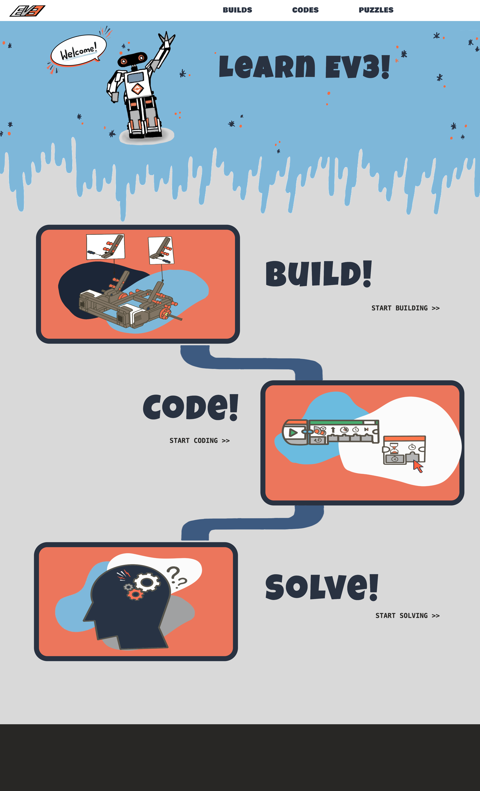
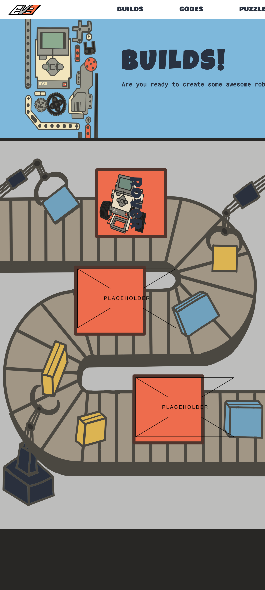
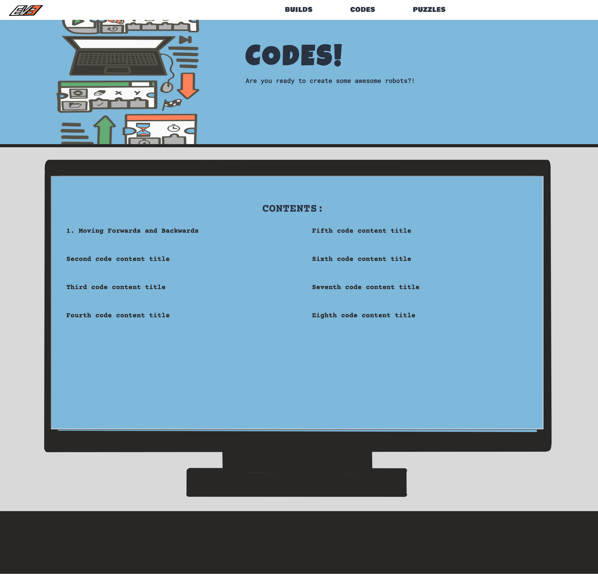

# EV3
### Project Description:
Comission design and basic HTML and CSS project in October 2021 during COVID for a student who was passionate about and interested in creating a EV3 Robotics Tutorial Website for young children to learn and be exposed to hardware programming from a young age. My responsibilities included all levels of design including pageflow, colors, fonts, etc.
## Index Page Screenshot:

## Builds Page Screenshot:

## Codes Page Screenshot:

